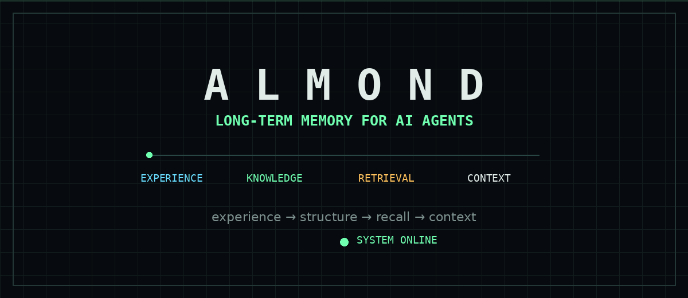
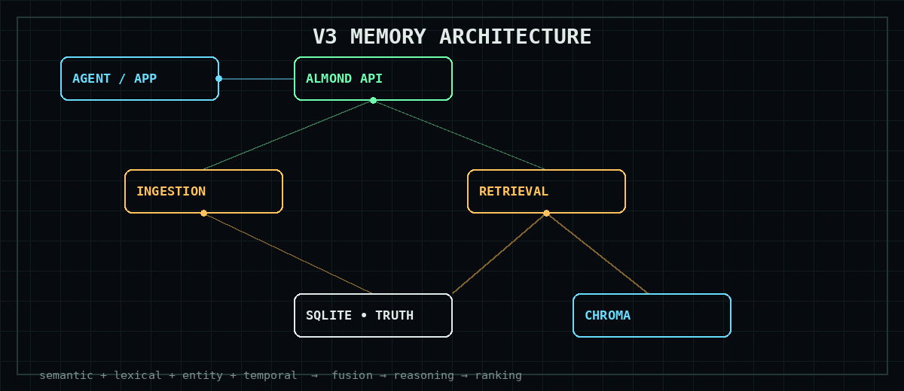
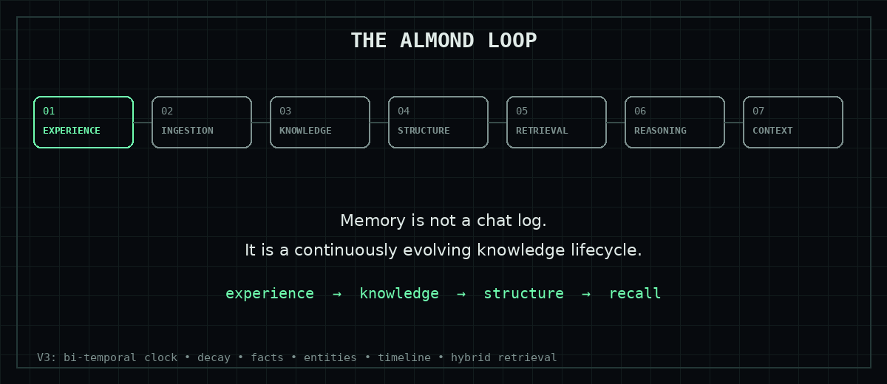

# 🧠 Almond

<p align="center">
  
</p>

<p align="center"><b>Long-term memory infrastructure for AI agents.</b><br>
Turning experience into structured, persistent, time-aware knowledge.</p>

<p align="center">


</p>

---

## What is Almond?

Most agent memory systems start with:

```text
conversation → embeddings → vector search
```

Almond treats memory as a **knowledge lifecycle** instead:

```text
Experience → Ingestion → Knowledge Extraction → Relational Truth
           → Derived Indexes → Hybrid Retrieval
           → Temporal / Constraint Reasoning → Context
```

The goal isn't simply to store more conversations.

**The goal is to give an agent the right knowledge at the right time.**

---

## ⚡ V3 at a glance

<p align="center"></p>

| Layer | Role |
|---|---|
| 🧠 Semantic | Meaning-based retrieval through Chroma |
| 🔎 Lexical | Exact/keyword retrieval through SQLite FTS5 |
| 👤 Entity | Alias resolution and entity-linked memories |
| ⏳ Temporal | Events, chronology and time constraints |
| 🔗 Fusion | Deduplicates and combines candidate channels |
| 🧩 Reasoning | Applies temporal and constraint logic |
| 📊 Ranking | Relevance + effective importance + temporal/entity fit |
| 📦 Context | Builds structured context for the downstream LLM |

---

## 🔄 Memory is a lifecycle

<p align="center"></p>

A memory can have an event time, ingestion time, reference time, importance, freshness, entities, structured facts, timeline relationships and lifecycle state.

### Effective importance

```text
P_eff = I_base × freshness
```

For retrieval, V3 combines this prior with query-specific signals:

```text
Score =
    wᵣ · S_relevance
  + wₚ · P_eff
  + wₜ · S_temporal_fit
  + wₑ · S_entity_fit
```

---

## 🕰️ Time is first-class

V3 separates:

```text
event_time       when something happened
ingestion_time   when Almond recorded it
reference_time   the perspective used for retrieval
```

This matters because:

> "What was true in March?"

is not necessarily the same question as:

> "What is true now?"

The clock is controllable, making temporal evaluation reproducible.

---

## 🧱 Source of truth

```text
                    ┌──────────────┐
                    │    SQLite    │
                    │    TRUTH     │
                    └──────┬───────┘
                           │
              ┌────────────┼────────────┐
              ↓            ↓            ↓
           Chroma       Timeline      Entity
          derived       derived       derived
```

SQLite owns persistent memory, entities, facts and timeline truth.

Vector, timeline and entity indexes are **derived state** and can be rebuilt.

---

## 🧪 Evaluation-first engineering

V3 includes executable golden cases for:

```text
001  strict temporal chronology
002  entity alias resolution
003  comparative reasoning
004  abstention when memories are absent
005  contradiction / supersession
006  reference-time decay
007  cascading deletion
008  cold index recovery
009  out-of-order ingestion
010  multi-session recall / context assembly
```

### Current baseline

```text
V2 benchmark
────────────────────────
85 questions
36.47% accuracy

V3 status
────────────────────────
architecture      ✓
golden cases      10 / 10
temporal engine   ✓
knowledge layer   ✓
hybrid retrieval  ✓
benchmark         pending
```

**V3 performance improvements are intentionally not claimed until the benchmark is run.**

---

## 🧬 V1 → V3

```text
V1
 └── Conversation memory prototype
       ↓
V2
 ├── Retrieval
 ├── Memory decay
 ├── Tiered storage
 └── Evaluation framework
       ↓
V3
 ├── Bi-temporal / reference-time reasoning
 ├── Structured facts
 ├── Entity registry
 ├── Timeline index
 ├── Hybrid retrieval
 ├── Temporal reasoning
 ├── Durable ingestion
 ├── Traceable retrieval
 └── Standalone memory service
```

Almond is being built as a **knowledge lifecycle system for AI agents**, not simply a database for old chats.

---

## 🏗️ Architecture

```text
                     ┌──────────────────┐
                     │    AI AGENT      │
                     └────────┬─────────┘
                              │
                         Almond SDK
                              │
                              ▼
                     ┌──────────────────┐
                     │   FastAPI /v3    │
                     └────────┬─────────┘
                              │
             ┌────────────────┼────────────────┐
             ▼                ▼                ▼
        Ingestion         Retrieval        Knowledge
          Service           Engine           Stores
             │                │
             ▼                ▼
       ingestion_jobs     Phase 3 pipeline
             │                │
             └────────┬───────┘
                      ▼
               ┌──────────────┐
               │    SQLite    │
               │    TRUTH     │
               └──────┬───────┘
                      │
             ┌────────┼────────┐
             ▼        ▼        ▼
          Chroma   Timeline   Entity
          derived  derived    derived
```

---

## 🛠️ Stack

```text
Python       Core architecture
SQLite       Persistent source of truth
ChromaDB     Semantic index
FastAPI      Standalone service
FTS5         Lexical retrieval
Pytest       Regression + integration tests
LLMs         Knowledge extraction / downstream reasoning
```

---

## 🚧 Roadmap

```text
[✓] Phase 0   V2 golden snapshot
[✓] Phase 1   Core data / lifecycle / clock / storage
[✓] Phase 2   Knowledge layer
[✓] Phase 3   Hybrid retrieval + temporal reasoning

[→] Phase 4   Standalone memory service + SDK
[ ] Phase 5   Console
[ ] Phase 6   Agent integration
[ ] Phase 7   Benchmark evaluation
[ ] Phase 8   Ablations + research artifacts
```

### Phase 4

The next milestone exposes V3 as a service:

```text
POST   /v3/memories
GET    /v3/memories/{id}
DELETE /v3/memories/{id}

POST   /v3/query
POST   /v3/query/trace

GET    /v3/timeline
GET    /v3/entities/{id}

POST   /v3/evaluations
GET    /v3/health
```

---

## 🔬 Research questions

Later evaluation will test:

**Hybrid vs semantic-only retrieval**

```text
semantic-only
      vs
semantic + lexical + entity + temporal
```

**Structured chronology vs unstructured prompt inference**

```text
structured timeline
      vs
unstructured context
```

**Dynamic reference-time freshness vs static assumptions**

```text
dynamic reference time
      vs
static decay reference
```

---

## 📌 Project status

Almond is an active research/engineering project.

The architecture is being built incrementally with explicit invariants, migrations, executable golden cases and regression tests.

It is **not** currently presented as a production-ready enterprise memory platform, and V3 benchmark improvements have not yet been established.

---

## 👋 Why Almond?

Giving an agent a bigger context window isn't the same thing as giving it memory.

A useful memory system needs to reason about:

```text
what happened
what matters
what changed
what conflicts
what is true now
what was true then
what should be recalled
and what should be forgotten
```

**Almond is an attempt to build that layer.**

---

<p align="center"><sub>Built with Love · Python · SQLite · Chroma · too many debugging sessions</sub></p>
